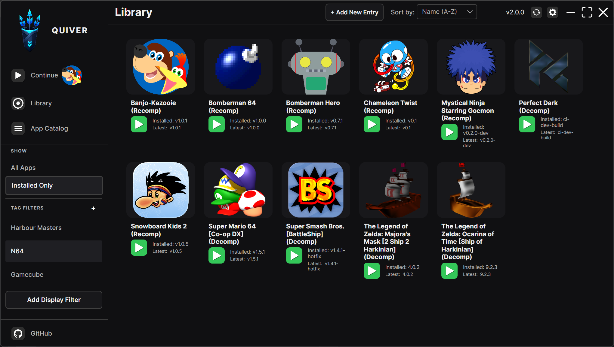

# Quiver

[](https://dotnet.microsoft.com/)
[](https://github.com/tgeorgiadis/quiver/blob/main/LICENSE)

> **About** — Quiver is a fork of [GithubLauncher](https://github.com/SirDiabo/GithubLauncher), extended with the features I wanted: **tag filters**, **library management with App Catalog**, and **UI improvements**. It was rebranded to **Quiver** to avoid using the GitHub trademark.



A modern launcher for downloading, installing, and running apps from GitHub releases — with a personal library, community catalog subscriptions, and flexible filtering.

## Features

- **Tag filters** — Organize and filter your library with custom tags
- **App Catalog** — Subscribe to community app lists, review changes, and build your library from `apps.json`
- **Automated updates** — Download and install the latest releases from GitHub
- **Version management** — Automatic version checking and in-app update checks
- **UI improvements** — Refined layout, catalog review workflow, and top-bar controls

## Getting Started

### Prerequisites

- .NET 9 Runtime (get it [here](https://dotnet.microsoft.com/en-us/))
- Internet connection for updates and downloads

### Installation

1. Download the latest release from the [Releases](https://github.com/tgeorgiadis/quiver/releases) page
2. Extract the downloaded archive to your preferred location
3. Run the executable.

## Usage

1. Launch the application
2. The launcher will automatically check for updates on startup
3. Browse your app library through the interface
4. Select an app and click "Download/Launch" to use it

## Local Development

When building and running from source, the launcher skips automatic self-update checks so a GitHub release does not overwrite your local build output.

- **Debug builds** (`dotnet run -c Debug`): startup self-update is always skipped.
- **Release builds** run locally: set `Quiver_SKIP_UPDATES=1` (or `true`) before launching.

Manual update checks from the in-app **Check for Updates** button still work in all configurations.

```powershell
# Debug — no env var needed
dotnet run --project Quiver.csproj -c Debug

# Release local testing
$env:Quiver_SKIP_UPDATES = "1"
dotnet run --project Quiver.csproj -c Release
```

If a previous run already downloaded a release into your output folder, delete `update_check.json` and any `backup_*` folders under `bin\Debug` or `bin\Release`, then rebuild.

### Automated tests

Run the xUnit test suite:

```powershell
dotnet test Quiver.sln
```

Release configuration matches CI:

```powershell
dotnet test Quiver.sln -c Release
```

Test categories include catalog merge and sync, settings store round-trip, launcher version helpers, Windows runner command building, download asset selection, game status checks, ViewModel sorting/catalog helpers, GameManager hide/filter behavior, and Avalonia headless smoke tests.

Collect coverage locally with:

```powershell
dotnet test Quiver.sln -c Release --collect:"XPlat Code Coverage"
```

## Configuration

### GitHub API Token
To avoid hitting GitHub's API rate limits, you can provide a personal access token.
Create a token with no special permissions needed and set it in the launcher settings.
You can create a token at ```GitHub Settings -> Developer settings > Personal access tokens > Tokens (classic) > Generate new token```
You don't need to give it any special permissions. Then paste that Token into your Settings field. Do not share your Token!

### apps.json and App Catalog

Fresh installs ship with an **empty** local [`apps.json`](apps.json). That file is your personal library — add apps from **App Catalog → Review** or with **+ Add New Entry**.

On first launch, Quiver shows a short welcome dialog, then subscribes to the official **[Quiver Community App Catalog](https://github.com/tgeorgiadis/quiver-community-app-catalog)**, fetches the list, and opens **App Catalog → Review** with the **New** filter so you can add apps individually or in bulk.

Raw catalog URL:

`https://raw.githubusercontent.com/tgeorgiadis/quiver-community-app-catalog/main/quiver-community-apps-catalog.json`

Use **App Catalog** anytime to review community entries and add the ones you want to your library. Installed app files on disk are never deleted automatically when you remove catalog entries or sources.

#### External catalog sources

You can add more catalogs in **App Catalog → Add Source** (remote raw GitHub URL or local file path). Each source is reviewed separately; your local `apps.json` takes priority when the same repository appears in multiple places.

When a subscribed list changes remotely, Quiver detects the diff on startup or when you click **Refresh All Sources**, then shows **Review changes** with per-app actions (Add, Replace, Merge, Ignore, Hide). Use **Not in library** to browse catalog apps you haven't added yet (including ignored ones). When every review item is synced or resolved, the catalog version is marked reviewed automatically. Use **Skip & mark reviewed** only to dismiss remaining items without syncing them.

See [`community-app-lists/README.md`](community-app-lists/README.md) for sample list format. The canonical community catalog lives in [`tgeorgiadis/quiver-community-app-catalog`](https://github.com/tgeorgiadis/quiver-community-app-catalog).

#### App Entry Properties

Each app entry requires the following properties:

- **`name`** - The display name of the app as it appears in the launcher
- **`repository`** - The GitHub repository in the format `username/repository`
- **`folderName`** - The folder name where the app will be downloaded and installed
- **`appIconUrl`** - URL of the app's icon image. If null, a default icon will be used.

#### Example Configuration

```json
{
    "apps": [
        {
            "name": "Example App",
            "repository": "username/example-app-repo",
            "folderName": "ExampleApp",
            "appIconUrl": null
        },
        {
            "name": "Another App",
            "repository": "anotheruser/another-app-repo",
            "folderName": "AnotherApp",
            "appIconUrl": "link/to/an/image.png"
        }
    ]
}
```

## Support

If you encounter any issues or have questions:
- [Open an issue](https://github.com/tgeorgiadis/quiver/issues)
- Check existing issues for solutions
