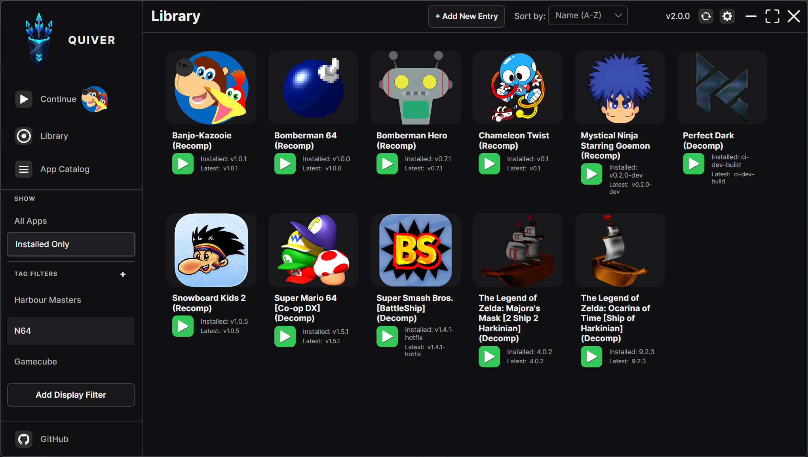

# Quiver

[](https://dotnet.microsoft.com/)
[](https://github.com/tgeorgiadis/quiver/blob/main/LICENSE)

> **About** — Quiver is a fork of [GithubLauncher](https://github.com/SirDiabo/GithubLauncher), extended with the features I wanted: **tag filters**, **library management with App Catalog**, and **UI improvements**. It was rebranded to **Quiver** to avoid using the GitHub trademark.



A modern launcher for downloading, installing, and running apps from GitHub releases — with a personal library, community catalog subscriptions, and flexible filtering.

## Features

- **Tag filters** — Organize and filter your library with custom tags
- **App Catalog** — Subscribe to community app lists, review changes, and build your library from `apps.json`
- **Automated updates** — Download and install the latest releases from GitHub
- **Version management** — Automatic version checking and in-app update checks
- **UI improvements** — Refined layout, catalog review workflow, and top-bar controls

## Getting Started

### Prerequisites

- Internet connection for updates and downloads
- Official builds are **self-contained** (no separate .NET install required). Local development still needs the .NET 9 SDK.

### Installation

Quiver uses [Velopack](https://docs.velopack.io/) for packaging and self-updates. Prerelease Quiver updates are opt-in via Settings → Advanced → **Include prerelease Quiver updates** (development only); installs whose version already contains `-` (e.g. `2.4.3-rc.3`) follow GitHub prereleases automatically.

**Windows (portable-first — recommended)**

1. Download `Quiver-Portable.zip` from [Releases](https://github.com/tgeorgiadis/quiver/releases)
2. Extract it anywhere (USB drive, folder, etc.)
3. Run `Quiver.exe` from the extracted folder

Your library stays in that same folder (`apps.json`, `settings.json`, `Apps/`, `Cache/` next to `current/`), so you can move the whole directory. Optional: `Quiver-Setup.exe` installs to LocalAppData with the same layout.

```
Quiver/
├── Quiver.exe          # launcher stub
├── current/            # app binaries (replaced on update)
├── apps.json
├── settings.json
├── Apps/
└── Cache/
```

**Linux**

1. Download the `.AppImage` for your architecture (x64 or ARM64)
2. Put it in a writable folder (USB drive, `~/Apps`, etc.)
3. Make it executable, then run it:
   ```bash
   chmod +x Quiver*.AppImage
   ./Quiver*.AppImage
   ```
   Or right-click → Properties → Permissions → **Allow executing file as a program**.  
   (Copies from Windows/NTFS/shared folders often lose the executable bit; `chmod +x` is expected in that case.)

Library data (`apps.json`, `settings.json`, `Apps/`, `Cache/`) is stored **beside the AppImage** so you can move that folder together. If the AppImage’s directory is not writable (e.g. `/usr/local/bin`), Quiver falls back to `~/.local/share/Quiver/` (or `$XDG_DATA_HOME/Quiver`).

```
MyFolder/
├── Quiver-x.y.z-linux-x64.AppImage
├── apps.json
├── settings.json
├── Apps/
└── Cache/
```

**macOS**

1. Download the Velopack macOS package from Releases
2. Keep `Quiver.app` in a writable folder (not only `/Applications` if you want portable data)

Library data lives **beside** `Quiver.app` in that folder. If the parent directory is not writable, Quiver falls back to `~/Library/Application Support/Quiver/`.

```
MyFolder/
├── Quiver.app
├── apps.json
├── settings.json
├── Apps/
└── Cache/
```

When Azure Artifact Signing is enabled, Windows packages are Authenticode-signed via the GitHub Environment **`signing`** (OIDC subject `repo:…/quiver:environment:signing`, so tag builds can sign the same way as `main`). To verify a signed `Quiver.exe`: right-click → Properties → Digital Signatures, or `Get-AuthenticodeSignature .\Quiver.exe` in PowerShell.

## Usage

1. Launch the application
2. The launcher will automatically check for updates on startup
3. Browse your app library through the interface
4. Select an app and click "Download/Launch" to use it

## Local Development

When building and running from source, Quiver is **not** a Velopack install, so self-update checks no-op (and Debug builds always skip automatic checks). Set `Quiver_SKIP_UPDATES=1` (or `true`) to skip automatic checks in Release local runs as well.

```powershell
# Debug — no env var needed
dotnet run --project Quiver.csproj -c Debug

# Release local testing
$env:Quiver_SKIP_UPDATES = "1"
dotnet run --project Quiver.csproj -c Release
```

User data for unpackaged Windows debug builds still lives beside the build output. Unpackaged macOS/Linux runs (no Velopack AppImage/`.app`) use the OS app-support fallbacks (`~/Library/Application Support/Quiver/` or `~/.local/share/Quiver/`).

### Automated tests

Fast local run (excludes the slow publish integration test; finishes in seconds):

```powershell
dotnet test Quiver.sln -c Release --filter "Category!=Slow" --logger "console;verbosity=normal"
```

Full suite including publish integration test (matches CI; the publish test can take several minutes):

```powershell
dotnet test Quiver.sln -c Release
```

Run only the slow publish packaging test:

```powershell
dotnet test Quiver.sln -c Release --filter "Category=Slow"
```

Test categories include catalog merge and sync, settings store round-trip, launcher version helpers, Windows runner command building, download asset selection, game status checks, ViewModel sorting/catalog helpers, GameManager hide/filter behavior, and Avalonia headless smoke tests.

Collect coverage locally with:

```powershell
dotnet test Quiver.sln -c Release --filter "Category!=Slow" --collect:"XPlat Code Coverage"
```

## Configuration

### GitHub API Token
To avoid hitting GitHub's API rate limits, you can provide a personal access token.
Create a token with no special permissions needed and set it in the launcher settings.
You can create a token at ```GitHub Settings -> Developer settings > Personal access tokens > Tokens (classic) > Generate new token```
You don't need to give it any special permissions. Then paste that Token into your Settings field. Do not share your Token!

### apps.json and App Catalog

Fresh installs ship with an **empty** local [`apps.json`](apps.json). That file is your personal library — add apps from **App Catalog → Review** or with **+ Add New Entry**.

On first launch, Quiver shows a short welcome dialog, then opens **App Catalog**. An internet connection is required the first time to fetch the community catalog index and list contents from GitHub. Browse the available lists, then use **Review** or **View** on a source to add apps to your library.

Community catalog lists are loaded from the remote index on startup and **Refresh All Sources**. New lists added to the [community catalog repo](https://github.com/tgeorgiadis/quiver-community-app-catalog) appear automatically without a Quiver app update. After a successful fetch, list contents are cached locally for offline review.

### Mods (Thunderstore & GameBanana)

Apps can expose a **Mods** browser when `mods.path` and `mods.sources` are set in the catalog entry (or via **+ Add New Entry**).

Optional `mods.layout`:

| Value | Behavior |
|-------|----------|
| *(omitted)* / `flat` | Extract archive paths as-is into the mods folder (default; typical for Thunderstore `.nrm` packs). |
| `folderPerMod` | If the archive has payload files at its root, wrap everything in a folder named from the download filename (e.g. `Music-FRLG.zip` → `mods/Music-FRLG/`). Archives that already use a top-level folder are left unchanged. |

Use `folderPerMod` for apps that expect each mod in its own subfolder (e.g. Pokemon Gen 1 Recomp). Enable it in the catalog JSON or with **Install each mod into its own folder** when editing an entry.

**Source URL formats** (one per line in Mod Sources):

| Provider | Examples |
|----------|----------|
| Thunderstore | `https://thunderstore.io/c/banjo-recompiled/` or slug `banjo-recompiled` |
| GameBanana | `https://gamebanana.com/mods/games/24774`, `https://gamebanana.com/games/24774`, or bare id `24774` |

GameBanana URLs are detected automatically (no `gamebanana|` prefix required). Other hosts can still use `provider|url`.

**Browse & search**

- **Thunderstore** uses the cyberstorm listing API (paged browse + `q=` search), preferring the community **Mods** section when available. Install/update resolves version and download URL via the experimental package API.
- **GameBanana** browses via Index pages and searches via Subfeed (`_sName`), keeping `_sModelName == Mod` only.
- Both sources support infinite scroll / load-more (mouse or gamepad). Multi-source search merges pages from each provider.
- Content-rated / NSFW mods are **hidden by default**. Use the **Include NSFW** chip to show them (persisted in settings).
- GameBanana mods with multiple download files show a file picker on Install/Update. **Zip** and **7z** archives are supported.

### Announcement banner

Quiver can show a dismissible sky-blue banner under the top bar with release notes or other notices. The text is loaded from a remote JSON file on startup — edit and push that file to announce something **without shipping a Quiver release**.

Remote URL:

`https://raw.githubusercontent.com/tgeorgiadis/quiver/main/announcement.json`

Repo file: [`announcement.json`](announcement.json)

```json
{
  "id": "2026-07-28-mods",
  "enabled": true,
  "message": "Your announcement text here."
}
```

- Change **`message`** to update the copy.
- Change **`id`** when you want the banner to appear again for users who already dismissed the previous notice (dismiss is forever **per id**).
- Set **`enabled`: false** to hide the banner for everyone without waiting for dismissals.

Remote index URL (the only catalog URL built into Quiver):

`https://raw.githubusercontent.com/tgeorgiadis/quiver-community-app-catalog/main/index.json`

List files live under `community-app-catalog/` in the [community catalog repo](https://github.com/tgeorgiadis/quiver-community-app-catalog). Quiver discovers them from the index at runtime. Each list file carries its own metadata (`name`, `description`, `version`) plus an `apps` array.

#### Community catalog index (v2)

The remote index is a registry of list IDs and fetch URLs only:

```json
{
  "version": 2,
  "lists": [
    {
      "id": "b4e8c2a1-3f5d-4e9b-8c7a-1d2e3f4a5b6c",
      "remoteLocation": "https://raw.githubusercontent.com/tgeorgiadis/quiver-community-app-catalog/main/community-app-catalog/N64-Recomps.json"
    }
  ]
}
```

#### Community catalog list file

Each list file defines the list metadata and its apps:

```json
{
  "name": "N64 Recomps",
  "description": "N64 recompilation ports",
  "version": "1.0.3",
  "apps": [
    {
      "name": "Example App",
      "repository": "username/example-app-repo",
      "folderName": "ExampleApp",
      "appIconUrl": null
    }
  ]
}
```

Quiver reads `name`, `description`, and `version` from the list file when a source is fetched or refreshed.

Use **App Catalog** anytime to review community entries and add the ones you want to your library. Installed app files on disk are never deleted automatically when you remove catalog entries or sources.

#### External catalog sources

You can add more catalogs in **App Catalog → Add Source** (remote raw GitHub URL or local file path). Each source is reviewed separately; your local `apps.json` takes priority when the same repository appears in multiple places.

When a subscribed list changes remotely, Quiver detects the diff on startup or when you click **Refresh All Sources**, then shows **Review changes** with per-app actions (Add, Replace, Merge, Ignore, Hide). Use **Not in library** to browse catalog apps you haven't added yet (including ignored ones). When every review item is synced or resolved, the catalog version is marked reviewed automatically. Use **Skip & mark reviewed** only to dismiss remaining items without syncing them.

See the [Quiver Community App Catalog](https://github.com/tgeorgiadis/quiver-community-app-catalog) repo for sample list format and the canonical community catalog.

#### App Entry Properties

Each app entry requires the following properties:

- **`name`** - The display name of the app as it appears in the launcher
- **`repository`** - The GitHub repository in the format `username/repository`
- **`folderName`** - The folder name where the app will be downloaded and installed
- **`appIconUrl`** - URL of the app's icon image. If null, a default icon will be used.

#### Example Configuration

```json
{
    "apps": [
        {
            "name": "Example App",
            "repository": "username/example-app-repo",
            "folderName": "ExampleApp",
            "appIconUrl": null
        },
        {
            "name": "Another App",
            "repository": "anotheruser/another-app-repo",
            "folderName": "AnotherApp",
            "appIconUrl": "link/to/an/image.png"
        }
    ]
}
```

## Support

If you encounter any issues or have questions:
- [Open an issue](https://github.com/tgeorgiadis/quiver/issues)
- Check existing issues for solutions
